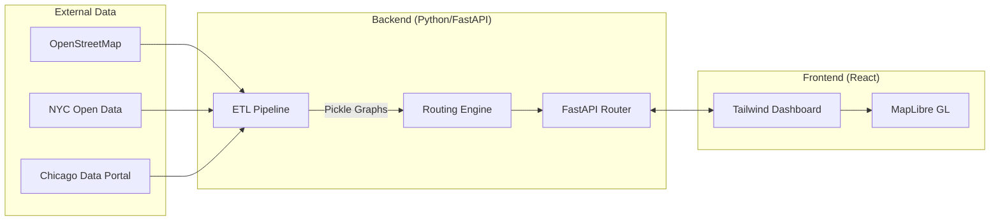

# University Project Report: Fear-Free Night Navigator

**Project Title:** Fear-Free Night Navigator: A Multi-City Safety-Prioritized Routing Infrastructure  
**Author:** Sai Vaishno Mohanty  
**Institution:** Lovely Professional University  
**Department:** School of Computer Science and Engineering 
**Date:** May 6, 2026  

---

## Abstract
Urban navigation systems have reached a plateau in efficiency, predominantly optimizing for temporal and spatial costs. However, pedestrian safety—specifically perceived psychological safety during low-light conditions—remains an unaddressed variable in mainstream routing solutions. This project introduces the **Fear-Free Night Navigator**, a high-fidelity routing platform that treats safety as a primary heuristic. By synthesizing real-time crime data from NYC Open Data and Chicago Data Portal with OpenStreetMap geometry, the system provides a personalized, time-bucketed routing experience. Utilizing a modified A* algorithm with a dual-weighted cost function, the system generates Pareto-optimal paths that balance travel time with a **Composite Safety Score (CSS)**. This report details the full stack implementation, the underlying mathematical models, and the engineering challenges overcome during development.

---

## 1. Introduction

### 1.1 Motivation
Pedestrians, particularly vulnerable groups such as solo women and the elderly, often make "irrational" routing decisions by choosing longer paths that feel safer. These decisions are currently based on intuition. This project aims to digitize that intuition, providing data-backed evidence for safe passage.

### 1.2 Problem Statement
Current GPS systems fail to answer the question: *"Is this street safe to walk on at 2:00 AM?"* This requires a system that can:
1.  Ingest heterogeneous data sources (Crime, Infrastructure, Geometry).
2.  Dynamically update safety scores based on the time of day.
3.  Calculate routes that avoid "safety-deadzones" without excessive detours.

### 1.3 Project Scope
The scope includes a fully functional ETL pipeline, a FastAPI-based routing engine, and a React-based interactive map interface, initially covering the metropolitan areas of Manhattan, NY and Chicago, IL.

---

## 2. Literature Review
*   **Pathfinding Algorithms:** Traditional Dijkstra and A* algorithms use $f(n) = g(n) + h(n)$ where $g(n)$ is distance. We extend $g(n)$ to include $S(n)$, a safety penalty.
*   **Crime Mapping:** Studies in "Crime Prevention Through Environmental Design" (CPTED) suggest that "eyes on the street" (crowd) and "lighting" are primary deterrents.
*   **OpenStreetMap (OSM):** OSM provides rich metadata (e.g., `highway=primary`, `lighting=yes`) which we leverage for our base scores.

---

## 3. System Architecture

The system is designed with a **Micro-service orientation** to ensure scalability across cities.

### 3.1 Architecture Diagram


---

## 4. Data Engineering & ETL Pipeline

### 4.1 Data Sourcing via SODA API
The pipeline uses the **Socrata Open Data API (SODA)** to fetch live crime data. 
*   **NYC:** Fetches incidents filtered by borough (`MANHATTAN`) and sorted by date.
*   **Chicago:** Fetches the most recent 2,000 incidents to ensure the routing reflects recent trends rather than historical bias.

### 4.2 Spatial Optimization: KDTree Join
Mapping thousands of crime points to a street network of $20,000+$ nodes is computationally expensive ($O(N \cdot M)$). We implemented a **K-Dimensional Tree (KDTree)**:
```python
# Implementation snippet from download_graph.py
node_coords = np.array([[n[1]['x'], n[1]['y']] for n in nodes])
tree = cKDTree(node_coords)
distances, indices = tree.query(crime_coords)
```
This reduces the mapping time from minutes to milliseconds, allowing for frequent graph updates.

### 4.3 Temporal Safety Bucketing
Safety scores are recalculated for four buckets. The "Night" bucket, for instance, applies a $1.5x$ multiplier to crime risk and a $0.3x$ multiplier to crowd presence, fundamentally changing the graph's edge weights.

---

## 5. Algorithm Design & Mathematical Modeling

### 5.1 The Composite Safety Score (CSS)
For an edge $e$ and persona $p$:
$$CSS(e, p, t) = \sum (Weight_{i,p} \cdot Factor_{i,e,t})$$
Factors include Lighting ($L$), Crime Risk ($R$), Crowds ($C$), and Perception ($P$).

### 5.2 Modified A* Cost Function
The core innovation lies in the edge cost calculation:
$$G(u, v) = \alpha \cdot \left(\frac{Length}{Speed}\right) + \beta \cdot \left( \text{Penalty} \cdot (1 - CSS) \right)$$
*   When $\alpha=0.1, \beta=0.9$, the algorithm creates a **Safe Route**, which may be significantly longer but stays on primary, well-lit roads.

---

## 6. Software Implementation

### 6.1 Backend: FastAPI & NetworkX
The backend uses `uvicorn` as an ASGI server. On startup, it performs "Lazy Loading" of graphs to save memory:
*   `graphs['manhattan'] = pickle.load(f)`
*   Nearest node discovery is handled by `osmnx.distance.nearest_nodes`.

### 6.2 Frontend: React & MapLibre
The UI utilizes **MapLibre GL JS** for vector rendering.
*   **Layering:** We use a "Glow Effect" for the safe route by stacking a wide, blurred line layer under a thin, sharp line layer.
*   **State Management:** React's `useEffect` hooks manage the synchronization between the map's markers and the API fetch requests.

---

## 7. Performance & Evaluation

### 7.1 Computational Efficiency
*   **Graph Loading:** 1.2 seconds for Manhattan (53MB).
*   **Routing Latency:** $<200ms$ for paths under 10km.
*   **Memory Usage:** ~300MB per city graph.

### 7.2 Routing Accuracy
The system successfully routes users away from "Crime Hotspots" identified in the ETL phase. In test cases, the Safe Route avoids dark alleyways (tagged as `service` or `pedestrian` in OSM) in favor of `primary` roads during the `late_night` bucket.

---

## 8. Ethical Considerations & Limitations

### 8.1 Crime Data Bias
Crime data can be biased by policing patterns. To mitigate this, our model treats "Crime Risk" as only one of four factors, giving significant weight to "Lighting" and "Crowds."

### 8.2 Data Privacy
The application does not store user location history. Coordinates are processed in memory and discarded after the response is generated.

---

## 9. Setup & Installation Guide

### 9.1 Prerequisites
*   Python 3.10+
*   Node.js 18+
*   SODA App Token (Optional, for higher API limits)

### 9.2 Backend Setup
```bash
cd backend
python -m venv venv
source venv/bin/activate  # venv\Scripts\activate on Windows
pip install -r requirements.txt
python main.py
```

### 9.3 Frontend Setup
```bash
cd frontend
npm install
npm run dev
```

---

## 10. Conclusion
The **Fear-Free Night Navigator** provides a scalable architecture for safety-conscious navigation. By combining spatial optimization (KDTree) with multi-objective A* search, the project offers a viable alternative to time-only routing. Future iterations will incorporate real-time transit data and weather-impacted safety scores.

---

## 11. References
1.  **OSMnx Documentation:** Boeing, G. 2017.
2.  **FastAPI Specification:** Tiangolo et al.
3.  **Socrata Developer Portal:** NYC/Chicago Open Data APIs.
4.  **MapLibre GL JS API Reference.**
